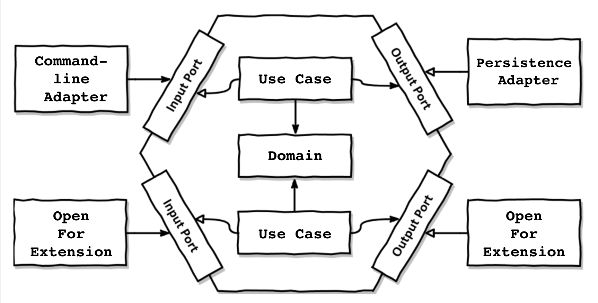

# Park-my-Car

## Architecture

- This is built with 'Ports & Adapters' aka 'Hexagonal' aka 'Clean' architecture.

- All layers depend inwards towards the core.

- This majorly has 4 modules, inorder to have clear boundaries in terms of dependencies.

  ### Core Module

  - This has the core business logic of the application.
  - It contains Domain entities and UseCases.
  - Each feature of this app is put in a separate UseCase and all the computation related to that feature resides in that UseCase. This abides to **Single Responsibility Principle (SRP)**.
- This layers also has Ports, which are the portals for UseCase to interact with infrastructure around.
  - These Ports are interfaces which are precise slices of what is needed for that UseCase. Nothing less, nothing more. This abides to **Interface segregation principle (ISP)**.
- These ports are implemented by external adapters, which are **Dependency Injected (DI)** at the runtime.
  - Core is agnostic of these Port implementations, so they can be easily replaced with different implementations. This abides to **Open-Closed Principle (OCP)**
  
  ### Exchange Module
  
  - This hosts the adapter for Command-line.
  - This is responsible for parsing command line inputs to Request Objects, which would be consumed by the UseCases.
  - This also has mappers to map UseCase output to results, that can be rendered anywhere, be it console or another bounded context.
  
  ### Persistence Module
  
  - This manages the entire state of the application. The only place where mutation and side-effects take place.
  - The State is SingleTon and all the changes are atomic
  
  ### App Module
  
  - This module wires all the modules together.
  - This has the DI config for the app and all the UseCases are orchestrated.
  - This hosts a client which takes in commands from console.
  
  ### Dependencies and Package Structure
  
  

## Functional Thinking

- This has been coded following **Functional Programming (FP)** principles.
- The entire app is a big function which takes in input and gives out an output. All the side-effects are peformed at the boundaries of the application.
- All functions in core are **Pure Functions**, whose output only depends on the parameters passed to it.
- No Unncessary inheritence overhead. `@FunctionalInterfaces` run the show.

## TDD

- The entire code is Test Driven.
- Thanks to the FP style **Isolation**, across the app **No Mocks** are used. All the FunctionalInterfaces can be conviniently stubbed as per the test.

### Remarks

Lombok is the only 3rd party lib used apart from Junit. Lombok just saves us from the verbosity of Java, generating alot of Boilerplate code. Similar features come natively in other languages like Kotlin.

Fun fact, lombok is the name of an awesome island in **Indonesia**.

## Steps to run

From the root directory

`bin/setup # This should build the artifacts and run the test suite`

Then to interact with the application, run

`bin/parking_lot # This should start an interactive shell to enter commands `

## License

 
All Software written by Gopal S Akshintala, is licensed under <a rel="license" href="https://opensource.org/licenses/MIT">MIT</a>.